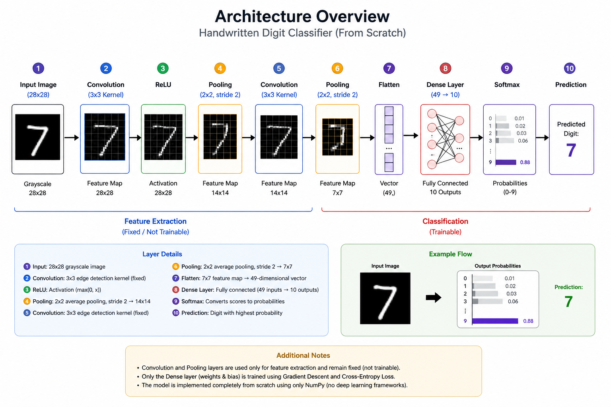
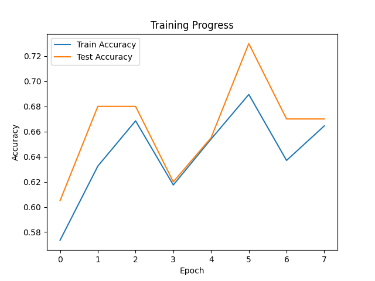

# CNN from Scratch (MNIST)

## Overview
This project implements a simple convolutional neural network pipeline from scratch — without using deep learning frameworks for training.

The system processes handwritten digit images (0–9) and classifies them using manually implemented convolution, pooling, and a softmax classifier.

---

## Architecture



Pipeline:

Input (28x28)  
→ Convolution (3x3 edge kernel)  
→ ReLU  
→ Pooling (2x2, stride 2)  
→ Convolution  
→ Pooling  
→ Flatten (7x7 → 49)  
→ Dense Layer (49 → 10)  
→ Softmax  

**Note:**  
- Feature extraction (convolution + pooling) is NOT trainable  
- Only the final dense layer is trained using gradient descent  

---

## Training Progress



- Training performed over multiple epochs  
- Accuracy improves significantly after learning  

---

## Predictions


Each image shows:
- True label (T)
- Predicted label (P)
- Confidence score

---

## Features

- Manual Convolution Layer (edge detection kernel)
- 2x2 Pooling with stride 2
- Flattening to feature vector
- Softmax classifier
- Cross-entropy gradient update
- Custom training loop (no frameworks)

---

## Results

- ~70% accuracy on MNIST after few epochs  
- Demonstrates full end-to-end learning pipeline  

---

## How to Run

```bash
pip install -r requirements.txt
python main.py
